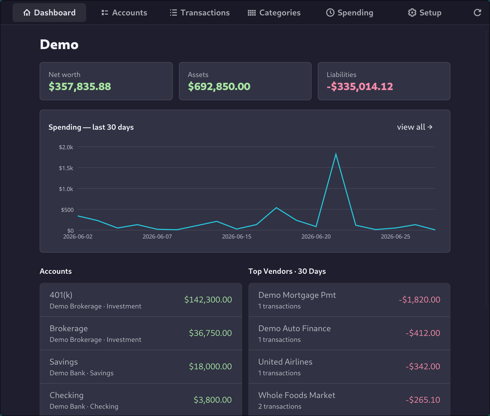
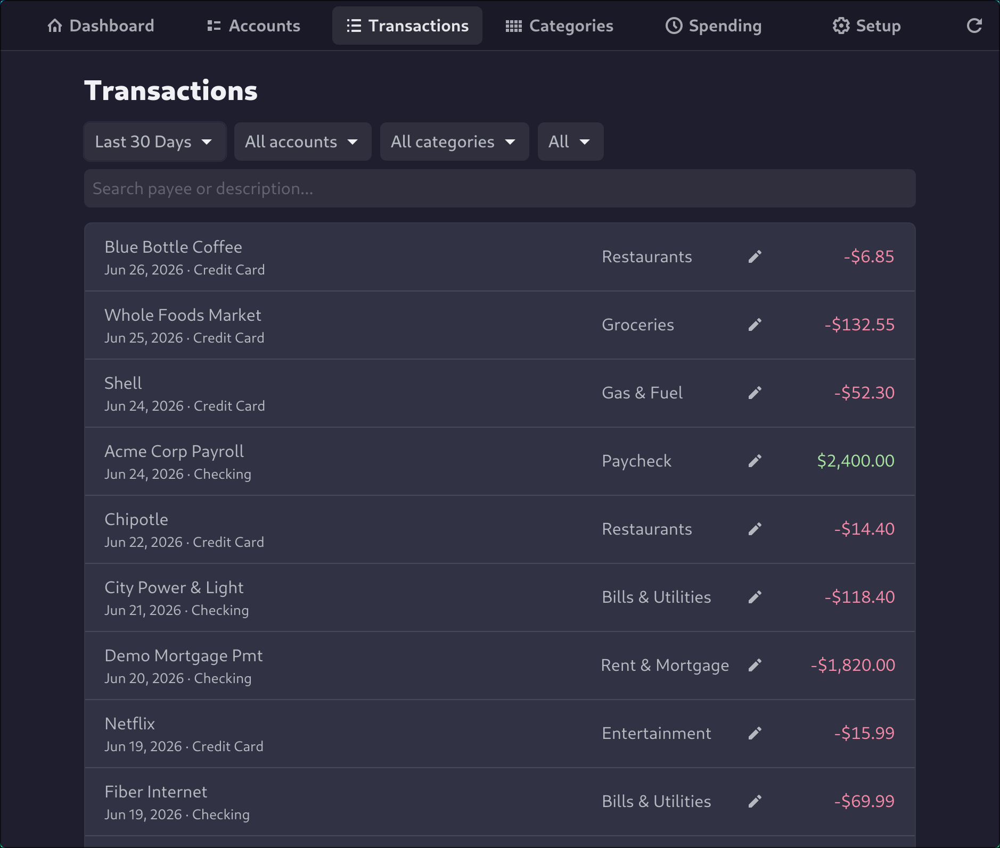

<p align="center">
  
</p>

# minfin

The first personal finance app I actually want to use. Every other one is bloated, expensive, hides your own data behind a subscription, and never ever does what you want it to do. `minfin` reads from [SimpleFIN](https://www.simplefin.org/). SimpleFIN is amazing and costs $1.50 per month to do the heavy lifting.

It syncs your accounts and transactions into a local SQLite file and shows you balances, spending, and categories. That's it.

I've used every alternative out there and this is the only one that gets it right.


### Web Application

<p align="center">
  
</p>

<p align="center">
  
</p>


### Desktop Application
<p align="center">
  
</p>
<p align="center">
  
</p>

## Build & run

#### Dependencies
- Go 1.26+.
- libadwaita-dev (for the GTK app)

```sh
make run        # or: make build && ./bin/minfin
```

Then open http://localhost:8080.

Config (all optional):
- `PORT` — HTTP port for the default loopback bind (default `8080`)
- `MINFIN_DB` — SQLite path (default `$XDG_DATA_HOME/minfin/minfin.db`) (~/.local/share/minfin/minfin.db)
- `MINFIN_JWT_SECRET` — signing key for auth tokens. **Required** when not in dev mode.
- `MINFIN_ADDR` — full listen address (e.g. `:8080`). Overrides the loopback default.
- `MINFIN_ALLOW_SIGNUP` — set to enable account registration (off by default).
- `MINFIN_DEV` — dev mode: ephemeral JWT secret, non-Secure cookies.

### Security Consideration

The server speaks plain HTTP and is not meant to face the internet directly.
By default it binds to `127.0.0.1`; to expose it, put a TLS-terminating reverse
proxy (Caddy, nginx) in front and point it at the loopback port, or set
`MINFIN_ADDR` to bind the proxy's upstream interface. Also set a strong
`MINFIN_JWT_SECRET` and decide on `MINFIN_ALLOW_SIGNUP`.

The SQLite database holds bank balances, full transaction history, and the SimpleFIN
access URL. `minfin` locks the DB file to owner-only
(`0600`), but it is not encrypted at rest and relies on full-disk encryption on
the host.

## SimpleFIN token

1. Get a setup token from [SimpleFIN Bridge](https://beta-bridge.simplefin.org/)
   (or any SimpleFIN provider).
2. Paste it into the setup form when you first open the app.

`minfin` exchanges it for a long-lived access URL, stores that in the database, and re-syncs every 6 hours.

## License

[MIT](LICENSE)
