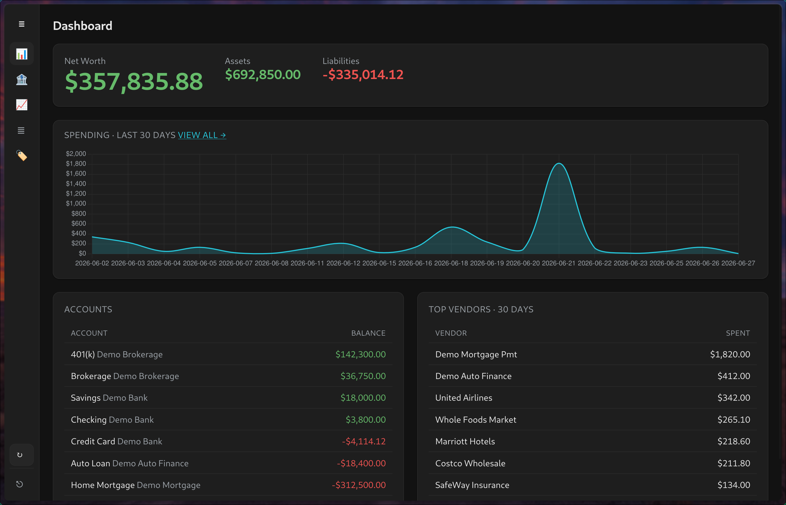
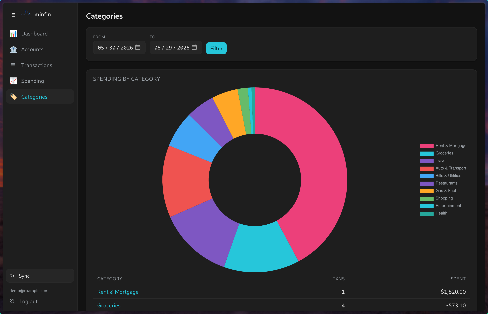

<p align="center">
  
</p>

# minfin

The first personal finance app I actually want to use. Every other one is bloated, expensive, hides your own data behind a subscription, and never ever does what you want it to do. `minfin` reads from [SimpleFIN](https://www.simplefin.org/). SimpleFIN is amazing and costs $1.50 per month to do the heavy lifting.

It syncs your accounts and transactions into a local SQLite file and shows you balances, spending, and categories. That's it.

I've used every alternative out there and this is the only one that gets it right.

<p align="center">
  
</p>

<p align="center">
  
</p>

## Build & run

#### Dependencies
- Go 1.26+.
- libadwaita-dev (for the GTK app)

```sh
make run        # or: make build && ./bin/minfin
```

Then open http://localhost:8080.

Config (all optional):
- `PORT` — HTTP port (default `8080`)
- `MINFIN_DB` — SQLite path (default `minfin.db`)

## SimpleFIN token

1. Get a setup token from [SimpleFIN Bridge](https://beta-bridge.simplefin.org/)
   (or any SimpleFIN provider).
2. Paste it into the setup form when you first open the app.

`minfin` exchanges it for a long-lived access URL, stores that in the database, and re-syncs every 6 hours.

## License

[MIT](LICENSE)
